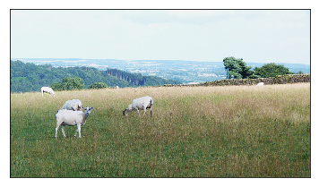
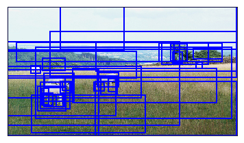
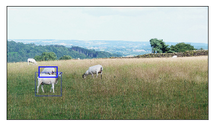
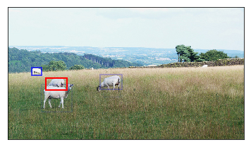
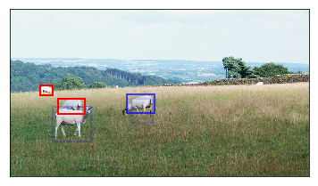
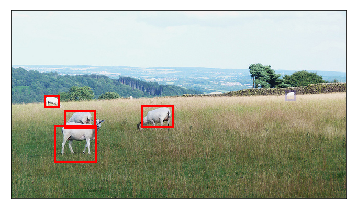

# irlc-vqa
Code for **[Interpretable Counting for Visual Question Answering](https://arxiv.org/pdf/1712.08697.pdf)** for ICLR 2018 reproducibility challenge. 

## About
The paper improves upon the state-of-the art accuracy for counting based questions in VQA. They do it by enforcing the prior that each count corresponds to a well defined region in the image and is not diffused all over it. They hard-attend over a fixed set of candiate regions (taken from pre-trained Faster-R-CNN network) in the image by fusing it with the information from the question. They use a variant of REINFORCE - Self Critical Training - which is well suited for generating sequences.

I found the paper quite interesting. Since I could not find any publicly available implementation of this paper I decided to implement it as a self-excercise.

## Results (without caption grounding)

#### SoftCount
| Model | Test Accuracy | Test RMSE | Training Time
| --- | --- | -- | -- |
| Reported | 49.2 | 2.45 | Unknown |
| This implementation | **49.7** | **2.31** | ~12 minutes (Nvidia-1080 Ti) |

#### IRLC
| Model | Test Accuracy | Test RMSE | Training Time
| --- | --- | -- | -- |
| Reported | **56.1** | 2.45 | Unknown |
| This implementation | 55.7* | **2.41** | ~6 hours (Nvidia-1080 Ti) |

*= Still improving. Work in Progress. 

The **accuracy** was calculated using the [VQA evaluation metric](http://www.visualqa.org/evaluation.html). I used the exact same script for calculating "soft score" as in https://github.com/hengyuan-hu/bottom-up-attention-vqa.

**RMSE** = root mean squared error from the ground truth (see below for how ground truth was chosen for VQA).

**Note**: These numbers correspond to the test accuracy and RMSE when the accuracy on the development set was maximum. The peak test accuracy is usually higher by about a percent.

## Key differences from the paper
- GRU was used instead of LSTM for generating question embeddings. Experiments with LSTM led to slower learning and more over-fitting. More hyper-parameter search is required to fix this.

- Gated Tanh Unit is not used. Instead, a 2-layer Leaky ReLu based network inspired by https://github.com/hengyuan-hu/bottom-up-attention-vqa with slight modifications is used.

## Filling in missing details in the paper

#### VQA Ground Truth
I couldn't find any annotations for a "single ground truth" which is requred to calculate the REINFORCE reward in IRLC. Also, I could not find any details in the paper relating to this issue. So I took as ground truth the label that was reported as the answer most number of times. In case there are more than one such label, the one having the least numerical value was picked (this might explain a lower RMSE).

#### Number of epochs
The authors mentioned that they use early stopping based on the development set accuracy but I couldn't find an exact method to determine when to stop. So I run the training for 100 epochs for IRLC and 20 epochs for SoftCount.

#### Number of candidate objects
I could not find the value of N = number of candidate objects that are taken from Faster-R-CNN so following https://github.com/hengyuan-hu/bottom-up-attention-vqa I took N=36. 

## Minor discrepancies

#### Number of images due to Visual Genome
From Table 1 in the paper, it would seem that adding the extra data from Visual Genome doesn't change the number of training images (31932). However, while writing the dataloaders for Visual Genome I noticed around 45k images after including the visual genome dataset. This is not really a big issue, but I still thought I'd write it so that other people can avoid wasting their time investigating it.

## Other Implementation Details

- This implementation borrows most of its pre-processing and data loading code from https://github.com/hengyuan-hu/bottom-up-attention-vqa

- The optional "caption grounding" step was skipped since it only improved the accuracy by a percent or so and was not the main focus of the paper.

- The authors didn't mention the amount of dropout they used. After trying a few values the value 0.5 was chosen.

- The value for number of samples was kept to 32 (instead of 5 as mentioned in the paper). The value 32 was chosen because it was the maximum value for which the training time did not suffer significantly. The effects of changing sample size on accuracy were not tested.

- All other parameters were kept same. Optimizer, learning rate, learning schedule, etc. are exactly the same as mentioned in the paper.

## Usage
#### Prerequisites
Make sure you are on a machine with an NVIDIA GPU and Python 3 with about 100 GB disk space. Python 2 might be required for running some scripts in ./tools (will try to fix this soon)

#### Installation
- Install PyTorch v0.4 with CUDA and Python 3.5.
- Install h5py.

#### Data Setup
All data should be downloaded to a 'data/' directory in the root directory of this repository.

The easiest way to download the data is to run the provided scripts `tools/download.sh` and then `tools/download_hmqa.sh` from the repository root. If the script does not work, it should be easy to examine the script and modify the steps outlined in it according to your needs. Then run `tools/process.sh` and `tools/process_hmqa.sh` from the repository root to process the data to the correct format. Some scripts in `tools/process.sh` might require Python2 (I am working on fixing this).

#### Training
Simply execute the cells in the IPython notebook `Training IRLC.ipynb` to start training. The development and testing scores will be printed every epoch. The model is saved every 10 epochs under the `saved_models` directory.

#### Visualization
Simply follow the `Visualize IRLC.ipynb` notebook. For this you will need to download MS-COCO images.

Here are sample visualizations:

Ques: How many sheepskin are grazing?

Ans: 4

Pred: 4

<pre> Original Image                                        Candidates Objects in image </pre>

  

IRLC assigns different probabilities to each candidate. Dark blue boxes is more probable, faint blue is less probable. IRLC then picks most probable ones first. The picked up objects are show in bright red boxes.

<pre> timestep=0                                              timestep=1 </pre>
  
<pre> timestep=2                                              timestep=3 </pre>
  
<pre> timestep=4   </pre>
  

## Acknowledgements
The repository https://github.com/hengyuan-hu/bottom-up-attention-vqa was a huge help. It would have taken me a week at the least to write all code for pre-processing the data myself. A big thanks to the authors of this repository!
